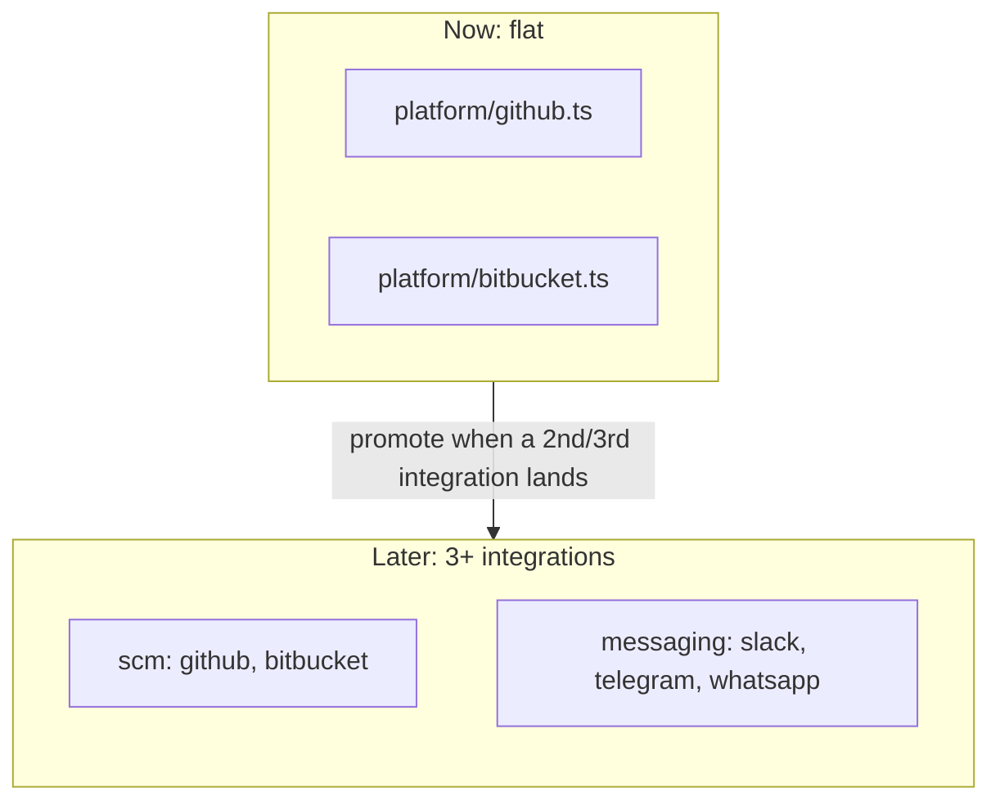
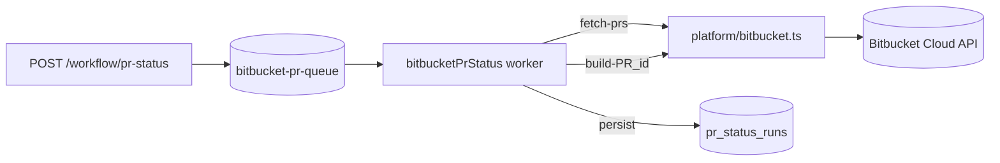

# 3P Integration Layer — LLD

**Date:** 2026-06-08
**Status:** Implemented (Bitbucket as first integration)
**Scope:** Define the convention for third-party (3P) integrations on the DBOS platform, and document Bitbucket as the first concrete implementation, consumed by the `bitbucketPrStatus` workflow.

---

## 1. Context & Constraints

Anchored to the platform north-star in `platform-architecture-refactor-plan_20260530.md`:

- The **workflow is first-class**; `platform/` is plumbing that no single workflow owns.
- **Decision #5 (locked):** no shared abstraction until a 2nd consumer genuinely needs it — avoid premature abstraction.
- **Precedent:** `platform/github.ts` is a flat client factory that reads `GITHUB_TOKEN` **inline from `process.env`** (NOT via `config.ts`). `config.ts` holds only DB url, pool size, and the LLM model.

These constraints drive the two headline decisions below: keep integration code **flat** for now, and read secrets **inline** per-integration.

---

## 2. The 3P Integration Convention

A "3P integration" is a flat module in `platform/` (e.g. `platform/bitbucket.ts`) that:

1. **Reads its own secret inline** from `process.env` (e.g. `BITBUCKET_TOKEN`), throwing a clear, actionable error if missing. Never routed through `config.ts`.
2. **Exposes a typed API wrapper** — named methods returning clean TypeScript interfaces that hide the vendor's wire/JSON shapes. This is an evolution beyond `github.ts`'s thin-client style: the integration owns the API surface, not just the auth.
3. Is **vendor-specific and stateless**, using a lazy singleton client where a client object exists (mirroring `getOctokit()`).
4. Is a **conceptual peer** to every other integration in one flat bucket, regardless of kind (SCM, messaging, etc.).

### Why flat (not a folder) now

Only one new integration (Bitbucket) exists today. Introducing a `platform/integrations/` or `3p/` folder for a single file is the exact premature abstraction Decision #5 forbids. The folder is a documented future step, not current code.

### Secret convention

| Integration | Env var | Read location |
|---|---|---|
| GitHub | `GITHUB_TOKEN` | inline in `platform/github.ts` |
| Bitbucket | `BITBUCKET_TOKEN` | inline in `platform/bitbucket.ts` |

`config.ts` stays limited to shared infra config (DB, pool, model).

### Future evolution (documented, NOT implemented)



- Once 3+ integrations exist (e.g. Slack, Telegram, WhatsApp), promote the flat files into `platform/integrations/` (or `3p/`).
- Messaging integrations may then share a `Notifier` interface so workflows depend on the capability, not the vendor.
- `github.ts` can be retrofitted to the typed-wrapper convention at that time.

---

## 3. Bitbucket Integration — `platform/bitbucket.ts`

A typed wrapper over the Bitbucket Cloud REST API `2.0`. Auth is `Authorization: Bearer ${BITBUCKET_TOKEN}` (a repo/workspace HTTP access token) over the global `fetch` (Node 20+). Endpoints and response shapes were validated against `atlassian/dt-proc`.

### Types

```ts
interface BitbucketPullRequest {
  id: number;
  title: string;
  author: string;
  sourceBranch: string;
  destBranch: string;
  commitHash: string;
  createdOn: string;
  updatedOn: string;
  url: string;
}

interface BitbucketBuildStatus {
  state: "SUCCESSFUL" | "FAILED" | "INPROGRESS" | "STOPPED" | "NO_BUILD";
  key?: string;
  name?: string;
  url?: string;
}
```

### Methods

| Method | Endpoint | Notes |
|---|---|---|
| `listOpenPullRequests(repo)` | `GET /repositories/{repo}/pullrequests?state=OPEN&pagelen=50` | maps `values[]` to `BitbucketPullRequest[]` |
| `getBuildStatus(repo, commitHash)` | `GET /repositories/{repo}/commit/{hash}/statuses?pagelen=10` | returns first status, or `{ state: "NO_BUILD" }` |
| `parseRepo(fullName)` | — | validates `workspace/slug`, mirrors `github.ts` |

Non-OK HTTP responses throw an `Error` with status + body so the calling DBOS step can retry.

---

## 4. `bitbucketPrStatus` Workflow

Vertical module at `src/workflows/bitbucket-pr-status/`, mirroring `scan-and-fix`.

### Layout

| File | Purpose |
|---|---|
| `constants.ts` | `QUEUE_NAME = "bitbucket-pr-queue"`, `WORKFLOW_NAME = "bitbucketPrStatus"` |
| `schemas.ts` | `PrWithBuild`, `PrStatusResult` (plain TS — deterministic fetch, no LLM output) |
| `steps/persist.ts` | `writePrStatus(...)` upsert into `pr_status_runs` (idempotent on `workflow_id`) |
| `schema.sql` | `pr_status_runs` table + index on `repo` |
| `routes.ts` | `POST /workflow/pr-status` (enqueue), `GET /workflow/pr-status/:id` (poll) |
| `index.ts` | orchestration + `WorkflowModule` export |

Integration calls run **directly inside `DBOS.runStep()`** in `index.ts` — the typed wrapper is the unit of work, so no thin fetch-wrapper step files. Only the DB write is a separate step file.

### Orchestration

```
bitbucketPrStatus(repo)
  step "fetch-prs":        bitbucket.listOpenPullRequests(repo)
  for each pr:
    step `build-${pr.id}`: bitbucket.getBuildStatus(repo, pr.commitHash)   // retriesAllowed, maxAttempts: 2
  failedCount = builds in { FAILED, STOPPED }
  step "persist":          writePrStatus(...)
  return PrStatusResult
```

Per-PR step name uses `pr.id` to satisfy the unique-step-name-in-loop rule (DBOS replay determinism).

### Data flow



---

## 5. Out of Scope (now)

- Slack/Telegram/WhatsApp integrations and any `Notifier` interface (future only).
- Moving `github.ts` into a folder or retrofitting it to the typed-wrapper convention.
- Scheduled trigger / webhook ingestion — workflow is enqueue-on-demand.
- Posting results to Slack — next iteration, once the core run is green.
