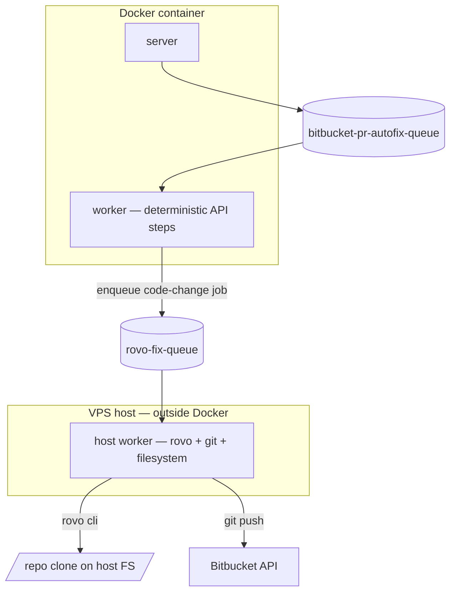

# Bitbucket PR Autofix — LLD

**Date:** 2026-06-08
**Status:** Implemented (retrigger-only MVP)
**Scope:** Define the design for `bitbucketPrAutofix`, a sequential, durable
workflow that discovers Bitbucket PRs with failing builds and attempts to
recover them. First iteration supports the `retrigger` action only; rebase and
code-change (via Rovo CLI) are designed-in but deferred.

---

## 1. Context

`bitbucketPrStatus` (see `3p-integration-layer-lld_20260608.md`) is read-only —
it produces a snapshot of every open PR's build state. The follow-up question
is operational: **for every failing PR, what's the cheapest recovery action
that gets the build green again?**

Constraints inherited from the platform north-star:

- **Workflow is first-class.** A new vertical module under `src/workflows/`,
  not a feature flag on the existing one.
- **3P integration convention.** Extend `platform/bitbucket.ts` with Pipelines
  API methods; do not introduce a new `platform/` module.
- **Decision #5 (no premature abstraction).** No `Action` interface yet — we
  have exactly one action.

---

## 2. Decisions

| # | Decision | Reason |
|---|---|---|
| D1 | New workflow `bitbucketPrAutofix`, not an extension of `bitbucketPrStatus` | Keeps the read-only snapshot decoupled from side-effecting actions. Separate persistence, separate API surface, easier to reason about and test. |
| D2 | Sequential PR processing (no parallel) for MVP | Predictable, easy to debug, no extra queue / handle juggling. Parallel is a 1-line swap to `DBOS.startWorkflow` once needed. |
| D3 | Discovery is **input-time choice**: `{ repo }` (fresh) OR `{ statusWorkflowId }` (reuse) | Most flexible without UI complexity. Reuse path lets a human curate the list (drop noisy PRs) before triggering autofix. |
| D4 | Poll loop uses `DBOS.sleep` between polls | Durable across worker restarts (the workspace memory + DBOS skill both call this out). `setTimeout` would be non-durable. |
| D5 | Pipelines API methods live in `platform/bitbucket.ts` (NOT a new file) | Single-vendor module. Same auth, same token, same wire format. Splitting at "by-resource" granularity is premature. |
| D6 | Rovo CLI is **out of scope** for MVP; planned to run on **host worker** (not inside Docker) | Avoids dragging `rovo` install + repo clones into the worker container. DBOS queues = heterogeneous workers fine. Documented but unimplemented. |
| D7 | One Postgres row per PR attempt (`pr_autofix_attempts`) keyed `(workflow_id, pr_id)` | Attempts are the natural unit of work for analytics ("how often does a plain retrigger fix a build?"). Avoids a single fat JSON blob per run. |

---

## 3. Flow

```mermaid
flowchart TB
  client[POST /workflow/pr-autofix] --> q[(bitbucket-pr-autofix-queue)]
  q --> wf[bitbucketPrAutofix worker]
  wf -->|"resolve-failing"| disc{source?}
  disc -->|discover| bb1[platform/bitbucket.ts: list + getBuildStatus]
  disc -->|reuse|    db1[(pr_status_runs)]
  wf -->|"persist-run-start"| db2[(pr_autofix_runs)]
  wf --> loop{for each failing PR}
  loop -->|"trigger-prId"|    bb2[platform/bitbucket.ts: triggerPipelineForBranch]
  loop -->|"DBOS.sleep + poll-prId-i"| bb3[platform/bitbucket.ts: getPipeline]
  loop -->|"persist-attempt-prId"|     db3[(pr_autofix_attempts)]
  loop -->|"persist-run-end"|          db2
```

---

## 4. Platform additions (`platform/bitbucket.ts`)

Three new typed methods + a small helper, inline with the existing convention
(inline-`BITBUCKET_TOKEN`, flat module, typed wrapper):

| Method | Endpoint | Notes |
|---|---|---|
| `triggerPipelineForBranch(repo, branch)` | `POST /repositories/{repo}/pipelines/` | body: `{ target: { ref_type: "branch", type: "pipeline_ref_target", ref_name } }` |
| `getPipeline(repo, uuid)` | `GET /repositories/{repo}/pipelines/{uuid}` | uuid is URL-encoded (Bitbucket returns `{uuid-with-braces}`) |
| `isPipelineTerminal(state)` | — | flat enum check |
| `flattenPipelineState(raw)` | — | private helper that maps Bitbucket's nested `{state.name, state.result.name}` into a flat `BitbucketPipelineState` |

Auth, error handling, and `bbGet`/`bbPost` are shared with the existing
`bitbucketPrStatus` calls.

---

## 5. Module layout

```
src/workflows/bitbucket-pr-autofix/
├── constants.ts                       QUEUE_NAME, WORKFLOW_NAME, POLL_INTERVAL_MS, MAX_POLLS, FAILED_BUILD_STATES
├── schemas.ts                         AutofixInput, AutofixResult, AutofixAttempt (plain TS types)
├── schema.sql                         pr_autofix_runs + pr_autofix_attempts
├── routes.ts                          POST + GET; Zod union { repo } | { statusWorkflowId }
├── README.md                          flow + future evolution
├── steps/
│   ├── resolveFailingPrs.ts           discoverFailingPrs() / reuseFailingPrsFromStatusRun()
│   └── persist.ts                     upsertAutofixRun() / upsertAutofixAttempt()
└── index.ts                           orchestration + WorkflowModule export
```

Registered via the existing `workflowModules` array in `src/workflows/index.ts`
— a single line append.

---

## 6. DBOS specifics

- **Step naming in loops** uses `${pr.id}` (and `${i}` for poll iterations) to
  satisfy the unique-step-name-in-loop rule.
- **Retries**: trigger and poll both `maxAttempts: 2, intervalSeconds: 3` —
  guards against transient 5xx without retrying on hard failures.
- **`DBOS.sleep` not `setTimeout`** — durable across restarts.
- **No nested workflows** — sequential per D2.

---

## 7. Out of scope (this iteration)

- `rebase` action (D6 → host worker plan covers the broader extension).
- `code-change` action via Rovo CLI (D6).
- Parallel PR processing (D2).
- Slack/webhook notifications.
- Periodic / scheduled autofix runs.

---

## 8. Future evolution (planned, NOT built)

### Rovo CLI on the host worker



- DBOS queues are Postgres rows → any worker process can subscribe regardless
  of where it runs.
- Docker image stays slim. CLI install + git auth lives on the host.
- Failure isolation: a hung `rovo` invocation only affects host-worker, not
  the deterministic Docker workflow runtime.

### Action policy via triage

A small triage step (LLM or rules) reads the failed pipeline's logs and
picks `retrigger | rebase | code-change`. The action enum on
`pr_autofix_attempts` already supports this — no schema change.
